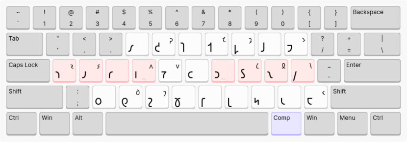

# jafl-xkb 𐑖𐑱𐑝𐑾𐑯 𐑮𐑰𐑛𐑥𐑦

𐑞𐑦𐑕 𐑦𐑕 𐑩 𐑐𐑹𐑑 𐑝 [@𐑖𐑱𐑝𐑾𐑯-𐑦𐑯𐑓𐑴](https://github.com/Shavian-info)'𐑟 [𐑦𐑒𐑕𐑐𐑧𐑮𐑦𐑥𐑧𐑯𐑑𐑩𐑤 "JAFL" 𐑤𐑱𐑬𐑑](https://discord.com/channels/270907769257721856/270913515777163265/1203296681878360075), 𐑩𐑤𐑪𐑙 𐑢𐑦𐑞 𐑩 𐑝𐑺𐑾𐑯𐑑 𐑿𐑟𐑦𐑙 𐑞 Dvorak 𐑐𐑳𐑙𐑒𐑗𐑫𐑱𐑖𐑩𐑯 𐑕𐑒𐑰𐑥. 𐑔 𐑐𐑳𐑙𐑛𐑗𐑫𐑱𐑖𐑩𐑯 𐑒𐑰𐑟 𐑸 𐑕𐑢𐑪𐑐𐑑 𐑢 𐑞𐑺 𐑒𐑹𐑩𐑕𐑐𐑪𐑯𐑛𐑦𐑙 𐑕𐑦𐑥𐑚𐑩𐑤 𐑦𐑯 𐑞 𐑳𐑞𐑼 𐑤𐑱𐑬𐑑.

### Qwerty-𐑕𐑑𐑱𐑩𐑤 𐑐𐑳𐑙𐑒𐑗𐑫𐑱𐑖𐑩𐑯

### Dvorak-𐑕𐑑𐑱𐑩𐑤 𐑐𐑳𐑙𐑒𐑗𐑫𐑱𐑖𐑩𐑯

### 𐑒𐑩𐑥𐑐𐑴𐑟 𐑕𐑰𐑒𐑢𐑩𐑯𐑕𐑩𐑟

MacOS JAFL 𐑿𐑟𐑩𐑟 𐑛𐑧𐑛-𐑒𐑰𐑟 𐑑 𐑐𐑮𐑩𐑛𐑵𐑕 𐑤𐑦𐑜𐑩𐑗𐑼𐑟, 𐑕𐑴 𐑑𐑱𐑐𐑦𐑙 `𐑩 𐑮` 𐑬𐑑𐑐𐑫𐑑𐑕 `𐑼`. 𐑣𐑬𐑧𐑝𐑼 𐑞𐑦𐑕 𐑦𐑕 𐑯𐑪𐑑 𐑐𐑪𐑕𐑦𐑚𐑩𐑤 𐑦𐑯 XKB; 𐑢𐑳𐑯 𐑒𐑫𐑛 𐑥𐑱𐑒 `𐑩` 𐑩 𐑛𐑧𐑛-𐑒𐑰, 𐑚𐑳𐑑 𐑞𐑧𐑯 𐑦𐑑 𐑢𐑫𐑛 𐑯𐑴𐑑 𐑚 𐑐𐑪𐑕𐑦𐑚𐑩𐑤 𐑑 𐑬𐑑𐑐𐑫𐑑 `𐑩` 𐑛𐑼𐑧𐑒𐑑𐑤𐑦 𐑢𐑦𐑞𐑬𐑑 𐑩 𐑒𐑰 𐑒𐑪𐑥𐑚𐑦𐑯𐑱𐑖𐑩𐑯 𐑤𐑲𐑒 `𐑩 𐑩`. 𐑝𐑺𐑦 𐑒𐑳𐑥𐑚𐑼𐑕𐑩𐑥! 𐑦𐑯𐑕𐑑𐑧𐑑, jafl-xkb 𐑿𐑟𐑩𐑟 𐑒𐑪𐑥𐑐𐑴𐑟 𐑕𐑰𐑒𐑢𐑩𐑯𐑕𐑩𐑟 𐑓 𐑤𐑦𐑜𐑩𐑗𐑼𐑟 𐑯 𐑦𐑒𐑕𐑑𐑧𐑯𐑛𐑩𐑛 𐑖𐑱𐑝𐑾𐑯 𐑒𐑺𐑩𐑒𐑑𐑼𐑟. 𐑞𐑦𐑕 𐑮𐑦𐑒𐑢𐑲𐑼𐑟 𐑚𐑲𐑯𐑛𐑦𐑙 𐑩 𐑥𐑪𐑚𐑐𐑴𐑟 𐑒𐑰: 𐑕𐑰 𐑗𐑶𐑕𐑩𐑟 𐑦𐑯 𐑞 "Position of Compose key" 𐑕𐑧𐑒𐑗𐑩𐑯 𐑝 𐑘𐑹 𐑒𐑰𐑚𐑹𐑛 𐑤𐑱𐑬𐑑 𐑪𐑐𐑖𐑩𐑯𐑟 (𐑹 𐑦𐑯 𐑞 "Compose Key" 𐑕𐑧𐑒𐑖𐑩𐑯 𐑝 `/usr/share/X11/xkb/rules/evdev.lst` 𐑓 𐑒𐑩𐑥𐑨𐑯𐑛-𐑤𐑲𐑯 𐑸𐑜𐑟). 𐑞 𐑤𐑱𐑬𐑑 𐑦𐑥𐑩𐑡𐑩𐑟 𐑿𐑟 𐑮𐑲𐑑 𐑪𐑤𐑑 𐑨𐑟 𐑒𐑩𐑥𐑐𐑴𐑟, 𐑕𐑧𐑑 𐑝𐑾 `setxkbmap -option compose:ralt`. 𐑑 𐑬𐑑𐑐𐑫𐑑 𐑩 𐑤𐑦𐑜𐑩𐑗𐑼, 𐑐𐑮𐑧𐑕 𐑞 𐑒𐑩𐑥𐑐𐑴𐑟 𐑒𐑰 𐑓𐑪𐑤𐑴𐑑 𐑚𐑲 𐑞 𐑒𐑰 𐑕𐑰𐑒𐑢𐑧𐑯𐑕 𐑓 𐑞𐑨𐑑 𐑕𐑦𐑥𐑚𐑩𐑤. 𐑓 𐑦𐑜𐑟𐑨𐑥𐑐𐑩𐑤 `<𐑒𐑩𐑥𐑐𐑴𐑟> 𐑩 𐑮` 𐑬𐑑𐑐𐑫𐑑𐑕 `𐑼`; `<𐑒𐑩𐑥𐑐𐑴𐑟> 𐑘 𐑵` 𐑬𐑑𐑐𐑫𐑑𐑕 `𐑿`.

𐑞 𐑦𐑒𐑕𐑑𐑧𐑯𐑛𐑩𐑛 𐑖𐑱𐑝𐑾𐑯 𐑒𐑺𐑩𐑒𐑑𐑼𐑟 𐑮𐑦𐑒𐑢𐑲𐑼 𐑩 𐑓𐑪𐑯𐑑 𐑞𐑨𐑑 𐑕𐑳𐑐𐑹𐑑𐑕 𐑞𐑱𐑥 𐑝𐑾 "Unicode Variaton Selector 1"; 𐑝 𐑦𐑜𐑟𐑨𐑯𐑐𐑩𐑤 [Inter Alia](https://github.com/Shavian-info/interalia?tab=readme-ov-file#extended-shavian-letters).

𐑖𐑦𐑓𐑑-𐑤𐑱𐑼 𐑐𐑳𐑙𐑒𐑗𐑫𐑱𐑖𐑩𐑯 𐑦𐑯 MacOS JAFL (𐑦𐑜𐑟 `_`, `‹`, `·`, 𐑯𐑯𐑯) 𐑦𐑟 𐑤𐑦𐑥𐑵𐑝𐑛 𐑣𐑽 𐑦𐑯 𐑓𐑱𐑝𐑼 𐑝 𐑒𐑩𐑥𐑐𐑴𐑟 𐑕𐑰𐑒𐑢𐑧𐑯𐑕𐑩𐑟 𐑹 𐑕𐑑𐑨𐑯𐑛𐑼𐑛 Qwerty/Dvorak 𐑐𐑳𐑙𐑒𐑗𐑫𐑱𐑖𐑩𐑯.

## 𐑦𐑯𐑕𐑑𐑩𐑤𐑱𐑖𐑩𐑯

𐑐𐑤𐑱𐑕 𐑞 𐑓𐑱𐑩𐑤 `shaw` 𐑦𐑯 𐑞 XKB 𐑕𐑦𐑯𐑚𐑩𐑤𐑕 𐑑𐑼𐑧𐑒𐑑𐑼𐑦 - 𐑤𐑲𐑒𐑤𐑦 `/usr/share/X11/xkb/symbols/shaw`. 𐑞𐑦𐑕 𐑩𐑤𐑬𐑟 𐑿 𐑑 𐑕𐑢𐑦𐑗 𐑑 𐑞 𐑒𐑰𐑚𐑹𐑛 𐑤𐑱𐑬𐑑 𐑢 𐑞 𐑒𐑩𐑥𐑨𐑯𐑛 𐑮𐑲𐑯: `setxkbmap shaw -option compose:ralt` 𐑹 `setxkbmap shaw -option compose:ralt`.

𐑐𐑤𐑱𐑕 𐑞 𐑓𐑱𐑩𐑤 `.XCompose` 𐑦𐑯 𐑘𐑹 𐑣𐑴𐑯 𐑑𐑼𐑧𐑒𐑑𐑼𐑦 - `~/.XCompose` - 𐑹 𐑒𐑪𐑐𐑦 𐑦𐑑𐑕 𐑒𐑪𐑯𐑑𐑧𐑯𐑑𐑕 𐑦𐑓 𐑞 𐑓𐑱𐑩𐑤 𐑷𐑤𐑮𐑧𐑛𐑦 𐑦𐑜𐑟𐑦𐑕𐑑𐑕. 𐑞𐑦𐑕 𐑩𐑤𐑬𐑟 𐑞 𐑒𐑩𐑯𐑐𐑴𐑟 𐑕𐑰𐑒𐑢𐑩𐑯𐑕𐑩𐑟 𐑑 𐑓𐑳𐑙𐑒𐑗𐑩𐑯.

𐑒𐑪𐑐𐑦 𐑞 𐑒𐑪𐑯𐑑𐑧𐑯𐑑𐑕 𐑝 `add-to-evdev.xml` 𐑑 𐑞 XKB evdev 𐑮𐑵𐑤𐑟 - 𐑤𐑲𐑒𐑤𐑦 `/usr/share/X11/xkb/rules/evdev.xml` - 𐑡𐑳𐑕𐑑 𐑚𐑦𐑓𐑹 𐑞 𐑤𐑲𐑯 𐑒𐑩𐑯𐑑𐑱𐑯𐑦𐑙 `</layoutList>`. 𐑞𐑦𐑕 𐑩𐑤𐑬𐑟 𐑢𐑹 𐑛𐑧𐑕𐑒𐑑𐑪𐑐 𐑦𐑯𐑝𐑲𐑮𐑩𐑯𐑥𐑩𐑯𐑑'𐑕 ⸰𐑜𐑿𐑦 𐑒𐑰𐑝𐑹𐑛 𐑒𐑩𐑯𐑝𐑦𐑜𐑘𐑼𐑱𐑑𐑼 𐑑 𐑤𐑴𐑒𐑱𐑑 𐑞 𐑖𐑱𐑝𐑾𐑯 𐑤𐑱𐑬𐑑𐑕. 𐑦𐑓 𐑿 𐑴𐑯𐑤𐑦 𐑿𐑟 `setxkbmap` 𐑞𐑦𐑕 𐑕𐑑𐑧𐑐 𐑦𐑟 𐑯𐑪𐑑 𐑕𐑑𐑮𐑦𐑒𐑑𐑤𐑦 𐑯𐑧𐑕𐑩𐑕𐑺𐑦.

𐑤𐑪𐑜 𐑱𐑑. 𐑮𐑳𐑯𐑦𐑙 𐑐𐑮𐑪𐑕𐑧𐑕𐑩𐑟 𐑢𐑦𐑤 𐑯𐑪𐑑 𐑮𐑧𐑒𐑩𐑜𐑯𐑲𐑟 𐑞 𐑯𐑿 𐑒𐑩𐑥𐑐𐑴𐑟 𐑕𐑰𐑒𐑢𐑩𐑯𐑕𐑩𐑟 𐑳𐑞𐑼𐑢𐑲𐑟.

## 𐑤𐑻𐑯𐑦𐑙

𐑑𐑦𐑐: 𐑿𐑟 `feh` 𐑑 𐑴𐑐𐑩𐑯 𐑞 𐑤𐑱𐑬𐑑 𐑦𐑥𐑩𐑡 𐑦𐑯 𐑩 𐑕𐑥𐑷𐑤 𐑢𐑦𐑯𐑛𐑴 𐑞𐑨𐑑 𐑿 𐑒𐑨𐑯 𐑒𐑰𐑐 𐑪𐑯-𐑕𐑒𐑮𐑰𐑯 𐑢𐑲𐑤 𐑤𐑻𐑯𐑦𐑙 𐑞𐑦𐑕 (𐑹 𐑧𐑯𐑦 𐑳𐑞𐑼) 𐑒𐑦𐑝𐑹 𐑤𐑱𐑬𐑑. 𐑦𐑜𐑟 `feh -x. img/jafl-qwerty.png`

# jafl-xkb Latin README

This is an XKB port of [@Shavian-info](https://github.com/Shavian-info)'s [experimental "JAFL" layout](https://discord.com/channels/270907769257721856/270913515777163265/1203296681878360075), along with a variant using the Dvorak punctuation scheme. The punctuation keys are swapped with their corresponding symbol in the other layout.

### Qwerty-style punctuation

### Dvorak-style punctuation

### Compose Sequences

MacOS JAFL uses dead-keys to produce ligatures, so typing `𐑩 𐑮` outputs `𐑼`. However this is not possible in XKB; one could make `𐑩` a dead-key, but then it would not be possible to output `𐑩` directly without a key combination like `𐑩 𐑩`. Very cumbersome! Instead, jafl-xkb uses compose sequences for ligutures and extended Shavian characters. This requires binding a compose key: see choices in the "Position of Compose key" section of your keyboard layout options (or in the "Compose Key" section of `/usr/share/X11/xkb/rules/evdev.lst` for CLI args). The layout images below use Right Alt as compose, set via `setxkbmap -option compose:ralt`. To output a ligature, press the Compose key followed by the key sequence for that symbol. For example `<Compose> 𐑩 𐑮` outputs `𐑼`; `<Compose> 𐑘 𐑵` outputs `𐑿`.

The extended shavian characters require a font that supports them via Unicode Variation Selector 1; for example [Inter Alia](https://github.com/Shavian-info/interalia?tab=readme-ov-file#extended-shavian-letters).

Shift-layer punctuation in MacOS JAFL (eg. `_`, `‹`, `·`, etc.) is removed here in favor of compose sequences or standard Qwerty/Dvorak punctuation.

## Installation

Place the file `shaw` in the XKB symbols directory - likely `/usr/share/X11/xkb/symbols/shaw`. This allows you to switch to the keyboard layout with the CLI: `setxkbmap shaw -option compose:ralt` or `setxkbmap shaw -variant dvorak -option compose:ralt`.

Place the file `.XCompose` in your home directory - `~/.XCompose` - or copy its contents to this location if the file already exists. This allows the compose sequences to function.

Copy the contents of `add-to-evdev.xml` to the XKB evdev rules - likely `/usr/share/X11/xkb/rules/evdev.xml` - just before the line containing `</layoutList>`. This allows your desktop environment's GUI keyboard configurator to locate the shavian layouts. If you only use `setxkbmap` this step is not strictly necessary.

Log out. Running processes will not recognize the new compose sequences.

## Learning

Tip: use `feh` to open the layout image in a small window that you can keep on-screen while learning this (or any other) keyboard layout. eg. `feh -x. img/jafl-qwerty.png`

