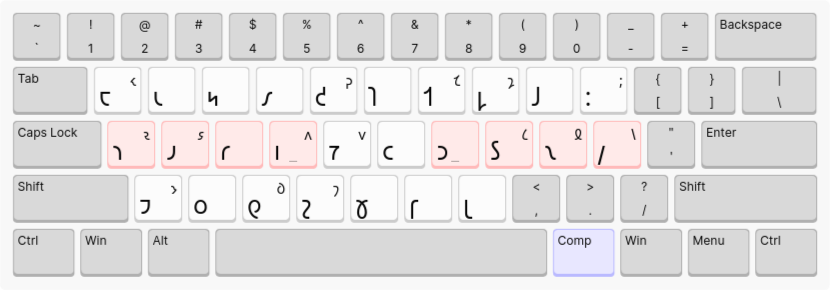
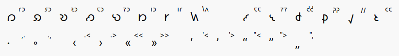

# jafl-xkb

This is an XKB port of [@Shavian-info](https://github.com/Shavian-info)'s [experimental "JAFL" layout](https://discord.com/channels/270907769257721856/270913515777163265/1203296681878360075), along with a variant using the Dvorak punctuation scheme. The punctuation keys are swapped with their corresponding symbol in the other layout.

## Qwerty-style punctuation

## Dvorak-style punctuation

## Compose Sequences

MacOS JAFL uses dead-keys to produce ligatures, so typing `𐑩 𐑮` outputs `𐑼`. However this is not possible in XKB; one could make `𐑩` a dead-key, but then it would not be possible to output `𐑩` directly without a key combination like `𐑩 𐑩`. Very cumbersome! Instead, jafl-xkb uses compose sequences for ligutures and extended Shavian characters. This requires binding a compose key: see choices in the "Position of Compose key" section of your keyboard layout options (or in the "Compose Key" section of `/usr/share/X11/xkb/rules/evdev.lst` for CLI args). The layout images below use Right Alt as compose, set via `setxkbmap -option compose:ralt`. To output a ligature, press the Compose key followed by the key sequence for that symbol. For example `<Compose> 𐑩 𐑮` outputs `𐑼`; `<Compose> 𐑘 𐑵` outputs `𐑿`.

The extended shavian characters require a font that supports them via Unicode Variation Selector 1; for example [Inter Alia](https://github.com/Shavian-info/interalia?tab=readme-ov-file#extended-shavian-letters).

Shift-layer punctuation in MacOS JAFL (eg. `_`, `‹`, `·`, etc.) is removed here in favor of compose sequences or standard Qwerty/Dvorak punctuation.

# Installation

Place the file `shaw` in the XKB symbols directory - likely `/usr/share/X11/xkb/symbols/shaw`. This allows you to switch to the keyboard layout with the CLI: `setxkbmap shaw -option compose:ralt` or `setxkbmap shaw -variant dvorak -option compose:ralt`.

Place the file `.XCompose` in your home directory - `~/.XCompose` - or copy its contents to this location if the file already exists. This allows the compose sequences to function.

Copy the contents of `add-to-evdev.xml` to the XKB evdev rules - likely `/usr/share/X11/xkb/rules/evdev.xml` - just before the line containing `</layoutList>`. This allows your desktop environment's GUI keyboard configurator to locate the shavian layouts. If you only use `setxkbmap` this step is not strictly necessary.

Log out. Running processes will not recognize the new compose sequences.

# Learning

Tip: use `feh` to open the layout image in a small window that you can keep on-screen while learning this (or any other) keyboard layout. eg. `feh -x. img/jafl-qwerty.png`
